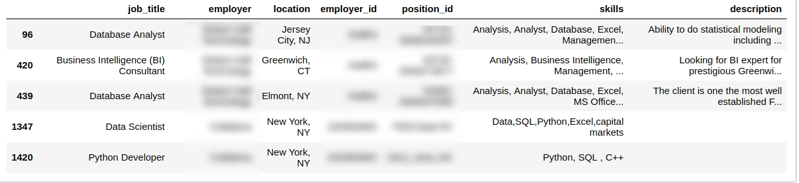

# Personalized job hunter

#### 1. Web scrapping and data analysis
This implementation scrapes online data for job hunting information, and stores the data into a MySQL databased. With these data, it can analyze the current job market, and also can help you to target the jobs that most similar to your background (resume) based on knn method. 

A sample of collected data as shown below.


Based on the collected data, analysis on the job market can be analyzed, such as mostly demanded skills and locations.

#### 2. Personalized job matching

With given resume/skill, the system could find the top 5 matched jobs in the database.

#####  2.1 Match by experience

For example, by inputting the experience section of an resume from a **web developer**, the following jobs whose description best match this person's experience is found as following.


##### 2.2 Math by skills 

For example, to match jobs by a person's skills: for a **data scientist** resume, we found the following skills:

```
Algorithms, Analysis, Database, Data Mining, Excel, HTTP, Management, Metrics, Modeling, Python, Programming, SQL, SQL Server
```

By k-nn in the databased, we can easily find the following jobs for this particular person.



